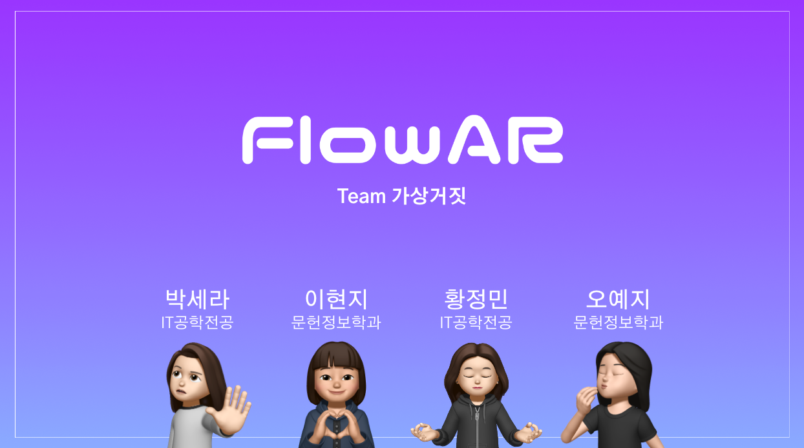

# 특별한 날을 위한 특별한 선물, FlowAR

 </img>

>22-2 숙명여대 가상및증강현실응용에서 진행한 캡스톤 프로젝트입니다.

 

# 프로젝트 소개

## 기획의도
온라인으로 꽃다발을 주문하기 어려운 이유에 대해 분석하던 중 기획하게 되었습니다. 
따라서 고른 꽃다발의 조합을 3D 객체로 렌더링한 후, 
`Unity`의 `AR Foundation`을 이용해 Body Tracking을 진행하여 꽃다발을 손 위에 올려볼 수 있게 했습니다.

## 개발 기간
2022.10 - 2022.12

## 주요 기능

✅ 3D로 렌더링된 디자인을 AR로 구현하여 보여줍니다.  
✅ 한 손에만 올려볼 수도 있고, 양 손에 올려볼 수도 있습니다.

 

# 📚 Stacks

  